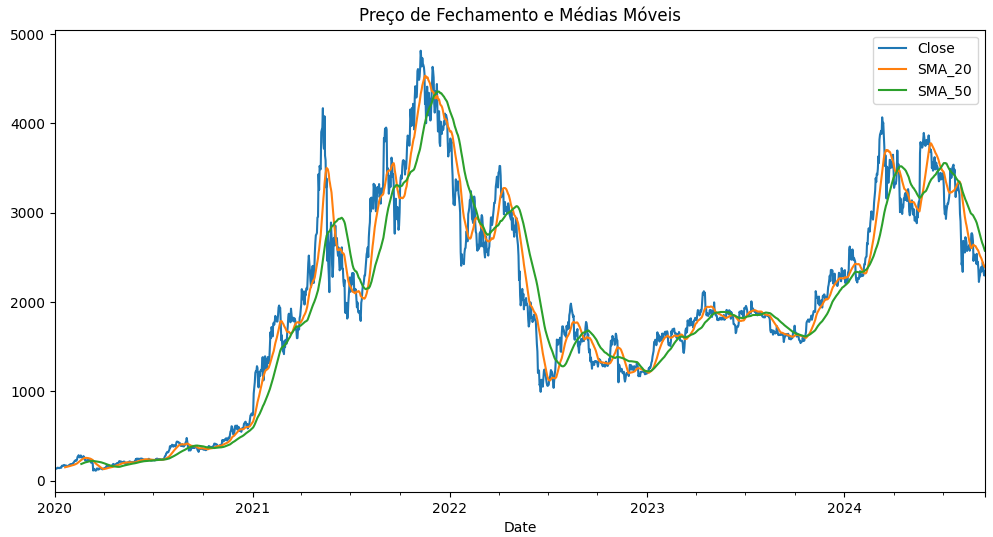
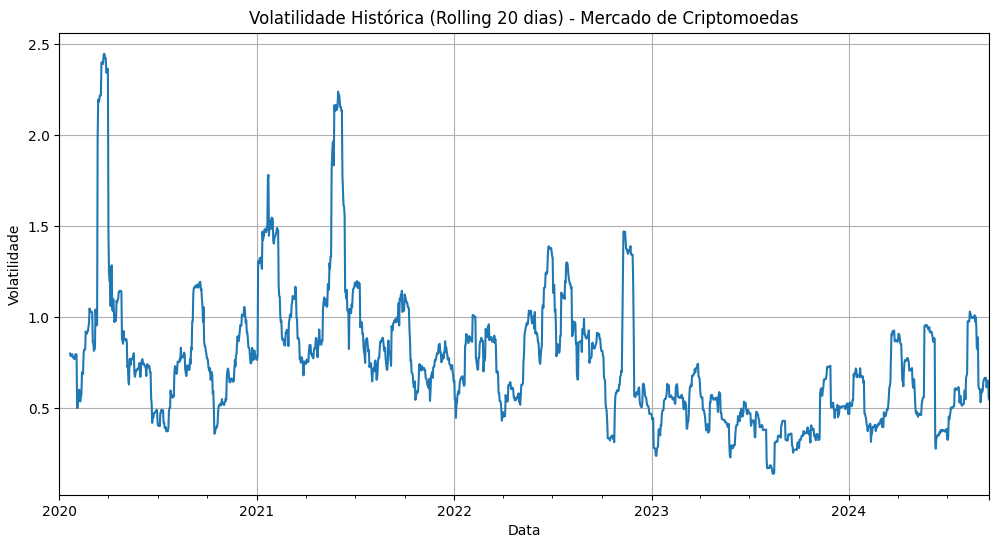
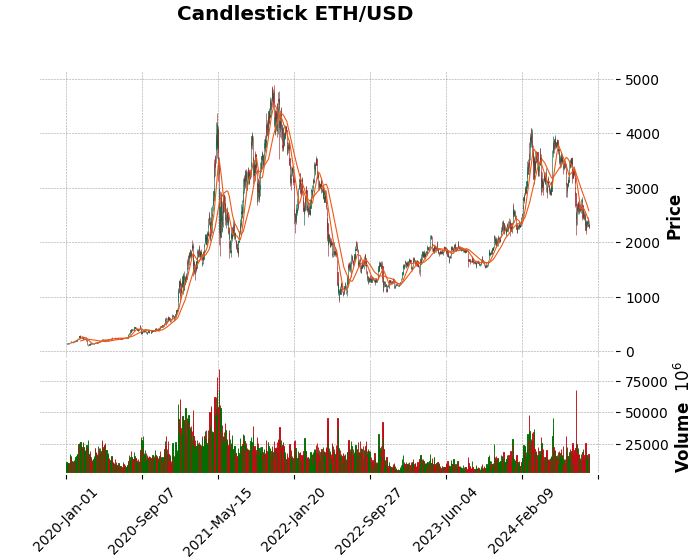
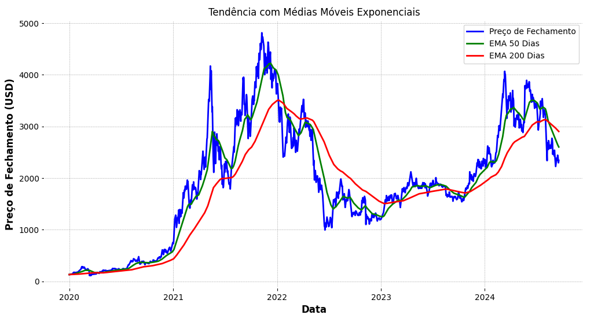
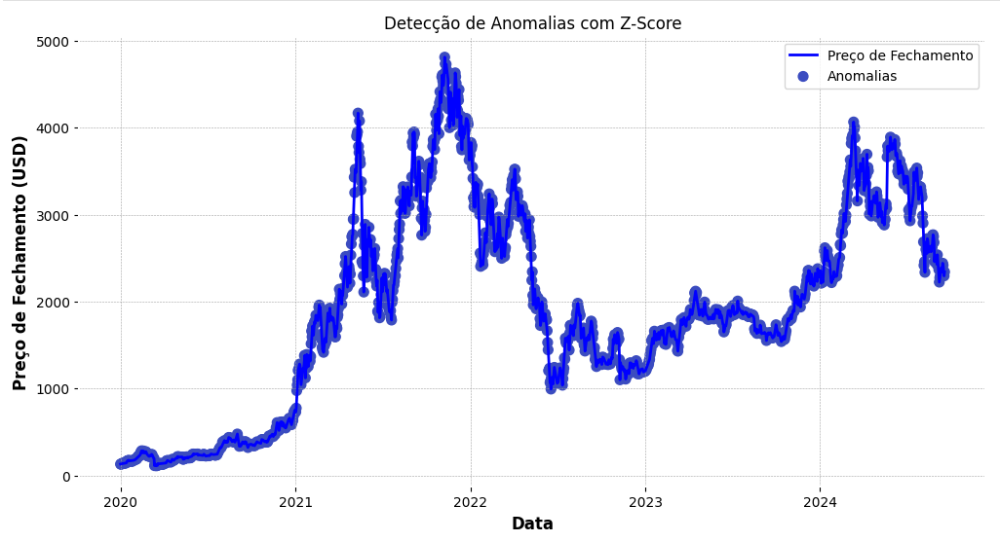
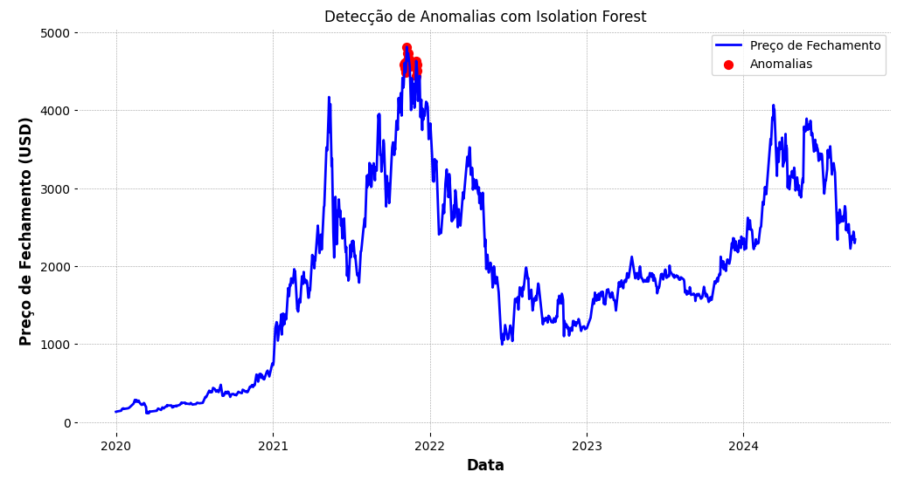
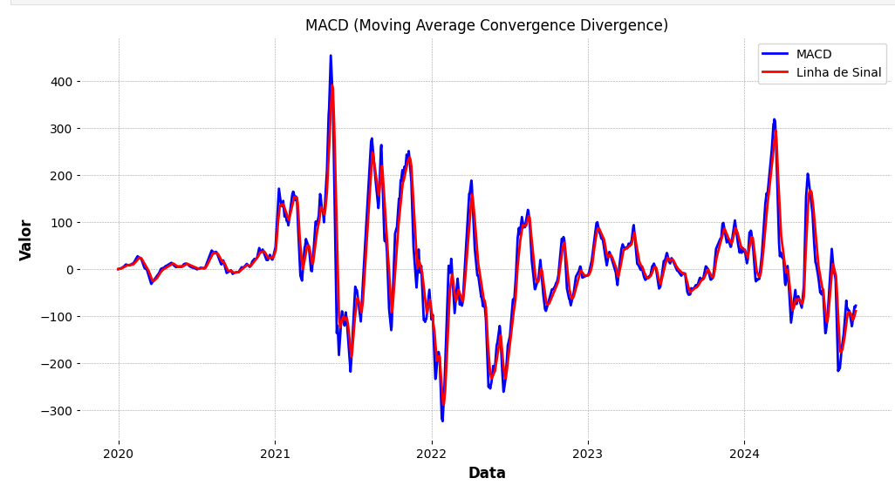

# Análise Exploratória e Detecção de Anomalias no Preço do Ethereum

## Introdução

&emsp;Neste notebook, decidi explorar o histórico de preços do Ethereum (ETH-USD) para realizar uma análise técnica detalhada e identificar possíveis padrões e anomalias no comportamento de seu preço ao longo do tempo. O Ethereum é uma das principais criptomoedas do mercado, e entender suas tendências de preço e volatilidade pode ser crucial para a construção de estratégias de investimento eficazes.

&emsp;Utilizando bibliotecas como `yfinance`, `mplfinance`, e `scikit-learn`, coletei dados históricos desde 2020 e apliquei diferentes indicadores técnicos, como médias móveis simples e exponenciais, volatilidade, e o MACD (Moving Average Convergence Divergence). Além disso, implementei modelos de detecção de anomalias, como Z-Score e Isolation Forest, para identificar flutuações atípicas no preço de fechamento.

&emsp;O objetivo deste estudo é não apenas explorar os dados históricos, mas também criar uma base sólida para futuras previsões e estratégias de trading, entendendo melhor o comportamento do mercado e as possíveis influências sobre o preço do Ethereum.

### Coleta de dados e exploração inicial

1. Instalação e importação de dependências

```python
!pip install yfinance mplfinance scikit-learn tensorflow matplotlib statsmodels arch
```

- **Objetivo:** Instalar as bibliotecas necessárias para a coleta, exploração e análise dos dados de criptoativos (ETH-USD), além de bibliotecas para machine learning e modelos de previsão.

2. Coleta dos dados históricos: ETH-USD

```python
symbol = 'ETH-USD'
eth_data = yf.download(symbol, start="2020-01-01", end="2024-09-18", interval="1d")
eth_data.head()
```

- **Objetivo:** Usar a API do yfinance para coletar dados históricos do par ETH-USD, permitindo a análise e construção de modelos preditivos.

3. Visualização do preço de fechamento

```python
eth_data['Close'].plot(figsize=(10,5))
plt.title('Histórico de Preço de Fechamento do Ethereum')
plt.xlabel('Data')
plt.ylabel('Preço de Fechamento (USD)')
plt.grid()
plt.show()
```

- **Objetivo:** Visualizar o comportamento histórico do preço de fechamento do Ethereum para entender a tendência geral dos dados ao longo do tempo.

4. Aplicação de média móvel para suavizar os dados

```python
eth_data['Close_Smooth'] = eth_data['Close'].rolling(window=20).mean()
plt.figure(figsize=(10, 5))
plt.plot(eth_data['Close_Smooth'], label='Preço de Fechamento (Média Móvel 20 dias)', color='blue')
plt.title('Histórico de Preço de Fechamento do Ethereum (Suavizado)')
plt.xlabel('Data')
plt.ylabel('Preço de Fechamento (USD)')
plt.grid(True)
plt.legend()
plt.show()
```

- **Objetivo:** Aplicar uma média móvel de 20 dias para suavizar as flutuações de curto prazo e destacar tendências mais claras no comportamento do preço.

5. Salvar os dados coletados em um arquivo CSV

```python
eth_data.to_csv('eth_historical_data.csv')
```

- **Objetivo:** Exportar os dados históricos do ETH-USD para um arquivo CSV para fins de armazenamento e reutilização futura.

### Análise exploratória e identificação de padrões

6. Examinando o formato dos dados

```python
eth_data.info()
eth_data.head()
```

- **Objetivo:** Verificar a estrutura dos dados coletados e garantir que todas as colunas necessárias foram capturadas corretamente, além de analisar os primeiros registros.

7. Cálculo e visualização de médias móveis simples (SMA)

```python
eth_data['SMA_20'] = eth_data['Close'].rolling(window=20).mean()
eth_data['SMA_50'] = eth_data['Close'].rolling(window=50).mean()
eth_data[['Close', 'SMA_20', 'SMA_50']].plot(figsize=(12, 6))
plt.title('Preço de Fechamento e Médias Móveis')
plt.show()
```

<p align="center"><b> Figura 1 - Figura média móvel de 20 e 50 dias</b></p>
<div align="center">
  
  <p><b>Fonte:</b> Elaborado por Marco Rizzi</p>
</div>

- **Objetivo:** Calcular e visualizar as médias móveis de 20 e 50 dias para analisar tendências de curto e médio prazo no preço de fechamento.

8. Cálculo da volatilidade diária

```python
eth_data['Daily_Return'] = eth_data['Close'].pct_change()
eth_data['Volatility'] = eth_data['Daily_Return'].rolling(window=20).std() * np.sqrt(365)
eth_data['Volatility'].plot(figsize=(12,6))
plt.title('Volatilidade Histórica (Rolling 20 dias) - Mercado de Criptomoedas')
plt.xlabel('Data')
plt.ylabel('Volatilidade')
plt.grid(True)
plt.show()
```

<p align="center"><b> Figura 2 - Figura volatilidade histórica</b></p>
<div align="center">
  
  <p><b>Fonte:</b> Elaborado por Marco Rizzi</p>
</div>

- **Objetivo:** Calcular a volatilidade histórica do Ethereum, ajudando a identificar os períodos de maior incerteza e flutuação no preço.

9. Correlação entre preço de fechamento e volume

```python
correlation = eth_data[['Close', 'Volume']].corr()
print(correlation)
```

- **Objetivo:** Avaliar a correlação entre o volume de negociação e o preço de fechamento para entender se o volume pode influenciar significativamente as variações no preço.

10. Criação de um gráfico de candlestick

```python
mpf.plot(eth_data, type='candle', style='charles', volume=True, mav=(20, 50), title="Candlestick ETH/USD")
```

<p align="center"><b> Figura 3 - Histórico de preços de fechamento Ethereum</b></p>
<div align="center">
  
  <p><b>Fonte:</b> Elaborado por Marco Rizzi</p>
</div>

- **Objetivo:** Visualizar o comportamento do preço com um gráfico de candlestick, facilitando a identificação de padrões de alta e baixa no mercado.

11. Cálculo da Média Móvel Exponencial (EMA)

```python
eth_data['EMA50'] = eth_data['Close'].ewm(span=50, adjust=False).mean()
eth_data['EMA200'] = eth_data['Close'].ewm(span=200, adjust=False).mean()
plt.figure(figsize=(12, 6))
plt.plot(eth_data['Close'], label='Preço de Fechamento', color='blue')
plt.plot(eth_data['EMA50'], label='EMA 50 Dias', color='green')
plt.plot(eth_data['EMA200'], label='EMA 200 Dias', color='red')
plt.title('Tendência com Médias Móveis Exponenciais')
plt.xlabel('Data')
plt.ylabel('Preço de Fechamento (USD)')
plt.legend()
plt.grid(True)
plt.show()
```

<p align="center"><b> Figura 4 - Calculando média móvel exponencial</b></p>
<div align="center">
  
  <p><b>Fonte:</b> Elaborado por Marco Rizzi</p>
</div>

- **Objetivo:** Calcular e visualizar as EMAs de 50 e 200 dias para detectar tendências de longo prazo e pontos potenciais de reversão no mercado.

### Identificação de anomalias

12. Detecção de anomalias com Z-Score

```python
eth_data['Z-Score'] = stats.zscore(eth_data['Close'].dropna())
anomaly_threshold = 3
eth_data['Anomaly'] = eth_data['Z-Score'].apply(lambda x: x if abs(x) > anomaly_threshold else 0)
plt.figure(figsize=(12, 6))
plt.plot(eth_data['Close'], label='Preço de Fechamento', color='blue')
plt.scatter(eth_data.index, eth_data['Close'], c=eth_data['Anomaly'], cmap='coolwarm', label='Anomalias', s=50)
plt.title('Detecção de Anomalias com Z-Score')
plt.xlabel('Data')
plt.ylabel('Preço de Fechamento (USD)')
plt.legend()
plt.grid(True)
plt.show()
```

<p align="center"><b> Figura 5 - Identificando anomalias com Z-score</b></p>
<div align="center">
  
  <p><b>Fonte:</b> Elaborado por Marco Rizzi</p>
</div>

- **Objetivo:** Identificar possíveis anomalias no preço de fechamento do Ethereum utilizando Z-Score, destacando valores que estão significativamente fora da média.

13. Detecção de anomalias com Isolation Forest

```python
isolation_forest = IsolationForest(contamination=0.01)
eth_data['Anomaly_IF'] = isolation_forest.fit_predict(eth_data[['Close']].dropna())
anomalies = eth_data[eth_data['Anomaly_IF'] == -1]
plt.figure(figsize=(12, 6))
plt.plot(eth_data['Close'], label='Preço de Fechamento', color='blue')
plt.scatter(anomalies.index, anomalies['Close'], color='red', label='Anomalias', s=50)
plt.title('Detecção de Anomalias com Isolation Forest')
plt.xlabel('Data')
plt.ylabel('Preço de Fechamento (USD)')
plt.legend()
plt.grid(True)
plt.show()
```

<p align="center"><b> Figura 6 - Identificando anomalias com Isolation Forest</b></p>
<div align="center">
  
  <p><b>Fonte:</b> Elaborado por Marco Rizzi</p>
</div>

- **Objetivo:** Usar o Isolation Forest para detectar anomalias no preço de fechamento, onde -1 indica uma possível anomalia.

14. Cálculo do MACD (Moving Average Convergence Divergence)

```python
eth_data['EMA12'] = eth_data['Close'].ewm(span=12, adjust=False).mean()
eth_data['EMA26'] = eth_data['Close'].ewm(span=26, adjust=False).mean()
eth_data['MACD'] = eth_data['EMA12'] - eth_data['EMA26']
eth_data['Signal_Line'] = eth_data['MACD'].ewm(span=9, adjust=False).mean()

plt.figure(figsize=(12, 6))
plt.plot(eth_data['MACD'], label='MACD', color='blue')
plt.plot(eth_data['Signal_Line'], label='Linha de Sinal', color='red')
plt.title('MACD (Moving Average Convergence Divergence)')
plt.xlabel('Data')
plt.ylabel('Valor')
plt.legend()
plt.grid(True)
plt.show()
```

<p align="center"><b> Figura 7 - Indicador MACD</b></p>
<div align="center">
  
  <p><b>Fonte:</b> Elaborado por Marco Rizzi</p>
</div>

- **Objetivo:** Calcular e visualizar o indicador MACD, que ajuda a identificar momentos de compra ou venda baseados na convergência ou divergência das médias móveis.

## Conclusão

&emsp;Neste notebook, realizei uma análise exploratória detalhada do histórico de preços do Ethereum (ETH-USD), incluindo o cálculo de indicadores técnicos e a detecção de anomalias. Ao longo do processo, apliquei ferramentas como médias móveis, análise de volatilidade e correlação, além de modelos de machine learning (Isolation Forest e Z-Score), o que me permitiu obter insights sobre o comportamento do preço ao longo do tempo.

&emsp;Explorei diferentes tipos de gráficos, como candlesticks, médias móveis exponenciais e o indicador MACD, que me ajudaram a visualizar melhor as tendências de mercado e potenciais pontos de entrada e saída para negociações.

&emsp;Ao identificar anomalias com o Z-Score e o Isolation Forest, consegui destacar períodos de volatilidade atípica e flutuações inesperadas no preço de fechamento. Isso me proporciona uma base sólida para construir estratégias mais robustas de mitigação de riscos e tomar decisões de investimento mais assertivas.

&emsp;Esse estudo me preparou para futuros desenvolvimentos de modelos de previsão e estratégias de trading automatizadas, ajudando a otimizar minha tomada de decisões no mercado de criptoativos com base em dados históricos e nas tendências detectadas.


