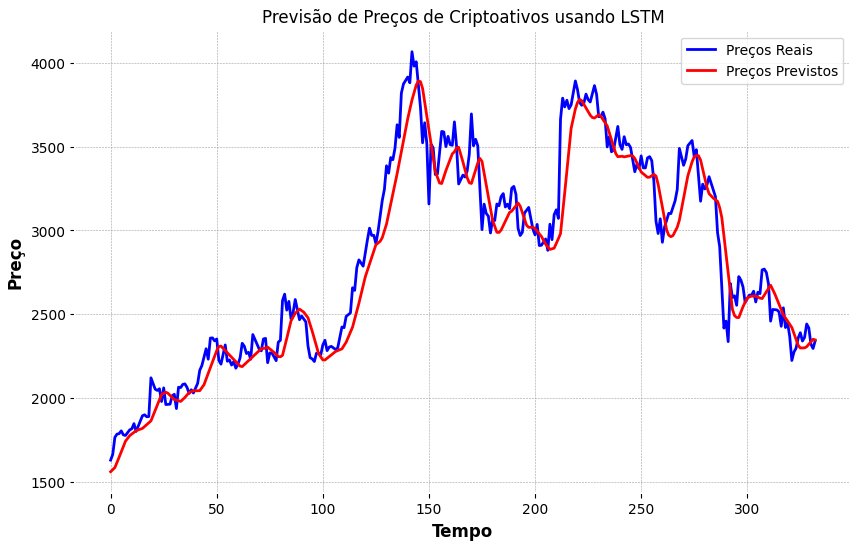
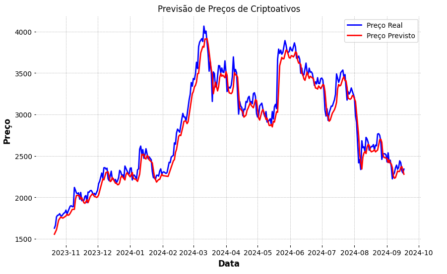

# Pŕe processamento dos dados e construção dos modelos LSTM e GRU

## Introdução

&emsp;Antes de utilizar os modelos de LSTM (Long Short-Term Memory) e GRU (Gated Recurrent Units), realizei uma série de etapas de pré-processamento nos dados históricos de preços do criptoativo Ethereum. Essas etapas foram fundamentais para garantir que os dados estivessem no formato adequado para serem usados nos modelos de aprendizado profundo.

### Pré processamento dos dados 

**1**. Carregamento e Limpeza dos Dados

&emsp;Inicialmente, carreguei os dados históricos de preços de fechamento ajustado para o Ethereum e removi qualquer valor ausente, garantindo que não houvesse lacunas nos dados que pudessem comprometer a performance dos modelos. 

```python
df = eth_data[['Close']].dropna()
```

**2**. Normalização dos Dados

&emsp;Os modelos LSTM e GRU tendem a ter melhor desempenho quando os dados são normalizados. Utilizei a técnica de normalização Min-Max, escalando os preços entre 0 e 1. Isso facilita o aprendizado do modelo, já que ele pode se concentrar em padrões de variação sem ser impactado pelos valores absolutos dos preços.

```python
scaler = MinMaxScaler(feature_range=(0, 1))
scaled_data = scaler.fit_transform(df)
```

**3**. Criação de Sequências de Dados

&emsp;Para prever o preço futuro de um criptoativo, criei janelas de tempo baseadas em sequências de preços passados. A cada sequência de 60 dias de preços, associei o preço do dia seguinte como o valor a ser previsto. Isso reflete a dinâmica do mercado financeiro, onde os preços futuros são fortemente influenciados pelos preços passados.

```python
def create_sequences(data, time_steps=60):
    X, y = [], []
    for i in range(len(data) - time_steps):
        X.append(data[i:i + time_steps, 0])
        y.append(data[i + time_steps, 0])
    return np.array(X), np.array(y)

time_steps = 60
X, y = create_sequences(scaled_data, time_steps)
```

**4**. Reshape dos Dados para os Modelos

&emsp;Os modelos LSTM e GRU exigem que os dados de entrada estejam no formato de três dimensões: `[samples, time_steps, features]`. Assim, reorganizei os dados para atender a esse formato.

```python
X = np.reshape(X, (X.shape[0], X.shape[1], 1))
```

**5**. Divisão dos Dados em Conjuntos de Treino e Teste

&emsp;Por fim, dividi os dados em conjuntos de treino e teste, onde 80% dos dados foram utilizados para treinar os modelos e 20% para testar o desempenho.

```python
split = int(X.shape[0] * 0.8)
X_train, y_train = X[:split], y[:split]
X_test, y_test = X[split:], y[split:]
```

### Modelo LSTM

&emsp;A LSTM (Long Short-Term Memory) é uma variação das redes neurais recorrentes que é particularmente eficaz em modelar dados sequenciais e identificar dependências de longo prazo. A LSTM é amplamente utilizada em séries temporais, como na previsão de preços de criptoativos.

**1**. Construção do Modelo LSTM

&emsp;Construi um modelo sequencial de LSTM com duas camadas LSTM. A primeira camada tem `return_sequences=True` para que o modelo possa passar a sequência completa para a próxima camada. Adicionei camadas de Dropout para ajudar na regularização, reduzindo o risco de overfitting.

```python
model = Sequential()
model.add(LSTM(units=50, return_sequences=True, input_shape=(X_train.shape[1], 1)))
model.add(Dropout(0.2))
model.add(LSTM(units=50, return_sequences=False))
model.add(Dropout(0.2))
model.add(Dense(units=1))
```

**2**. Compilação do Modelo

&emsp;Utilizei o otimizador `adam` e a função de perda `mean_squared_error` (MSE), que é adequada para problemas de regressão, como a previsão de preços.

```python
model.compile(optimizer='adam', loss='mean_squared_error')
```

**3**. Treinamento do Modelo

&emsp;O modelo foi treinado por 20 épocas, utilizando um batch size de 32. Além disso, utilizei o conjunto de teste como conjunto de validação durante o treinamento para monitorar o desempenho do modelo.

```python
history = model.fit(X_train, y_train, epochs=20, batch_size=32, validation_data=(X_test, y_test))
```

**4**. Avaliação e Previsão

&emsp;Depois do treinamento, utilizei o modelo para prever os preços no conjunto de teste e inverti a normalização dos dados para retornar os preços previstos ao seu valor original.

```python
predicted_prices = model.predict(X_test)
predicted_prices = scaler.inverse_transform(predicted_prices.reshape(-1, 1))
real_prices = scaler.inverse_transform(y_test.reshape(-1, 1))
```

**5**. Visualização dos Resultados

&emsp;Plotar os preços reais e previstos em um gráfico ajudou a visualizar o desempenho do modelo.

```python
plt.plot(real_prices, color='blue', label='Preços Reais')
plt.plot(predicted_prices, color='red', label='Preços Previstos')
```

<p align="center"><b> Figura 1 - Gráfico para visualizar Preços reais x Preços previstos</b></p>
<div align="center">
  
  <p><b>Fonte:</b> Elaborado por Marco Rizzi</p>
</div>

### Modelo GRU

&emsp;A GRU (Gated Recurrent Unit) é outra variação das redes neurais recorrentes, projetada para ser mais simples e computacionalmente eficiente do que a LSTM, mas ainda capaz de lidar com dependências de longo prazo.

**1**. Construção do Modelo GRU

&emsp;O modelo GRU foi construído de forma similar ao modelo LSTM, com duas camadas GRU e Dropout para regularização.

```python
model = Sequential()
model.add(GRU(units=100, return_sequences=True, input_shape=(X_train.shape[1], 1)))
model.add(Dropout(0.2))
model.add(GRU(units=100, return_sequences=False))
model.add(Dropout(0.2))
model.add(Dense(units=1))
```

**2**. Compilação do Modelo

&emsp;Também utilizei o otimizador `adam` e a função de perda `mean_squared_error` para o modelo GRU.

```python
model.compile(optimizer='adam', loss='mean_squared_error')
```

**3**. Treinamento e Avaliação

&emsp;O modelo foi treinado e avaliado de forma semelhante ao LSTM, utilizando os mesmos parâmetros de treino e teste.

```python
history = model.fit(X_train, y_train, epochs=20, batch_size=32, validation_data=(X_test, y_test))
```

**4**. Previsão e Visualização

&emsp;As previsões do modelo GRU foram plotadas e comparadas com os preços reais, fornecendo uma análise visual do desempenho do modelo.

```python
plt.plot(real_prices, color='blue', label='Preço Real')
plt.plot(predicted_prices, color='red', label='Preço Previsto')
```

<p align="center"><b> Figura 2 - Gráfico para visualizar Preços reais x Preços previstos</b></p>
<div align="center">
  
  <p><b>Fonte:</b> Elaborado por Marco Rizzi</p>
</div>

## Conclusão

&emsp;Ambos os modelos, LSTM e GRU, foram utilizados para prever os preços de criptoativos com base em dados históricos. O pré-processamento dos dados foi essencial para garantir que os modelos pudessem aprender e prever com precisão, e os gráficos comparando os preços reais com os previstos forneceram uma visão clara da eficácia de cada modelo.
